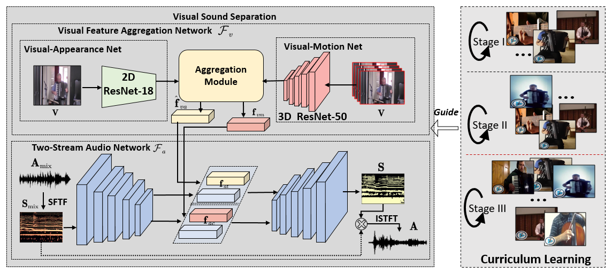
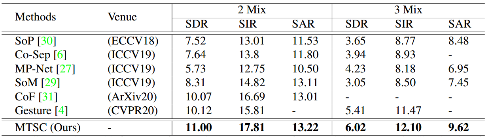
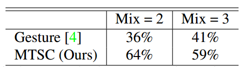
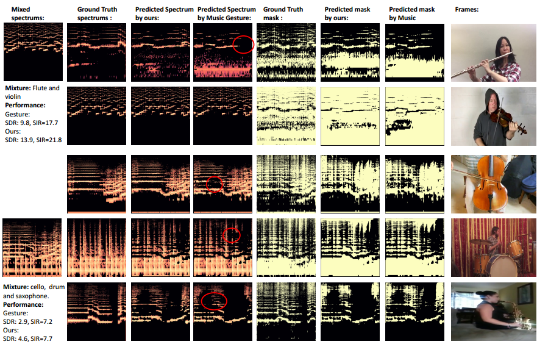
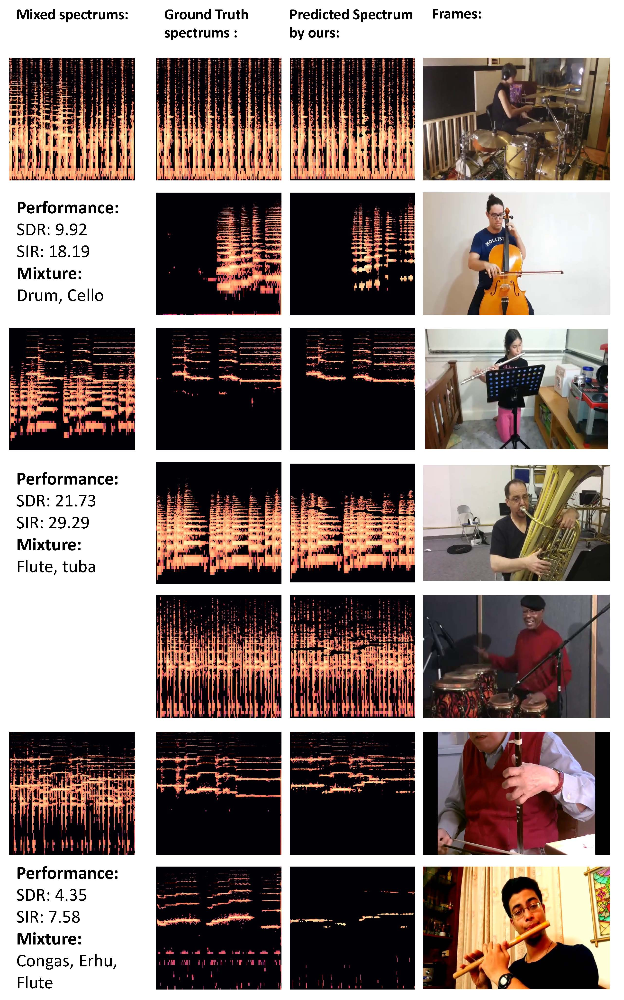
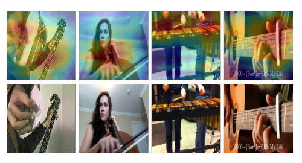

## Introduction

This is the implementation code and instruction of the proposed work  *"Modeling Two-Stream Correspondence for Visual Sound Separation"* (MTSC).

## Environment Requirements

Our code runs based on the following dependencies:
- python3
- torch
- numpy
- mir_eval
- argparse
- librosa
- torchaudio
- PIL
- torchvision
  
## Training 

### Datasets Preparation
The datasets we used for training and evaluation are listed as follow:

- Music21: https://github.com/roudimit/MUSIC_dataset
- URMP: http://www2.ece.rochester.edu/projects/air/projects/URMP.html

### Running
Using the following command to train and evaluate our model.
```
python main.py
```

## Main Idea
We propose a novel end-to-end framework termed Modeling Two-Stream Correspondence (MTSC) for visual sound separation (VSS) problem by explicitly extracting the timbre and content features in audio modality.

Unlike Previous VSS methods that mainly capture the global level audio-visual correspondence and exploit various visual features to enhance the appearance and motion features of visual modality, the proposed MTSC model employs a lightweight two-stream architecture to enhance audio-visual correspondence for both the appearance-timbre and motion-content features.

<div align="center">

</div>

<!-- **What Task Does Our Code Solve** -->
### What Task Does Our MTSC Method Solves

Visual sound separation (VSS) aims to obtain each sound component from the mixed audio signals with the guidance of visual information. Previous works typically suffered the following issue: 1) they value the visual features too much while neglecting the intrinsic properties of audio cues on separating the mixture of sounds; 2) The visual feature extraction process in those methods is complicated, and some of them can only be performed off-line, hence inhibiting forming an end-to-end learning framework; 
3) They commonly neglect the intrinsic properties of the audio modality, resulting in less effective audio features extraction and unbalanced audio-visual correspondence. The sound timber is related to the appearance of the sound maker and the content is synchronized with the motion of sound maker.

<!-- **Insight of Our Work** -->
### Insight of Our Work

1. We propose a novel end-to-end framework termed Modeling Two-Stream Correspondence for visual sound separation
2. Instead of just evolving the features for visual modality, we point out a promising research issue on improving the audio net into two stream fashion to learn the timbre and content information in audio modality..
3. We propose a more compact and efficient design without complicated visual net, and a novel aggregation module to enhance the visual semantic representation.
4. We design an advanced three-stage curriculum training strategy with soft transition between different stages and less human intervention to better guide the model training.

## Overall Results

<!-- **Results on Music21 Dataset** -->
### Results on Music21 Dataset
<div align="center">

</div>

<!-- **Results on URMP Dataset** -->
### Results on URMP Dataset
<div align="center">

</div>


<!-- **Examples of Separating Mixture Audios** -->

### Examples of Separating Mixture Audios
<div align="center">

</div>
<div align="center">

</div>


<!-- **Visualization of What Our Model Care** -->

### Visualization of Visual-audio Retrieval
<div align="center">

</div>

<!-- Our code is built based on:
```
@InProceedings{Zhao_2018_ECCV,
        author = {Zhao, Hang and Gan, Chuang and Rouditchenko, Andrew and Vondrick, Carl and McDermott, Josh and Torralba, Antonio},
        title = {The Sound of Pixels},
        booktitle = {The European Conference on Computer Vision (ECCV)},
        month = {September},
        year = {2018}
 }
```
```
@inproceedings{hara3dcnns,
  author={Kensho Hara and Hirokatsu Kataoka and Yutaka Satoh},
  title={Can Spatiotemporal 3D CNNs Retrace the History of 2D CNNs and ImageNet?},
  booktitle={Proceedings of the IEEE Conference on Computer Vision and Pattern Recognition (CVPR)},
  pages={6546--6555},
  year={2018},
}
​``` -->
```